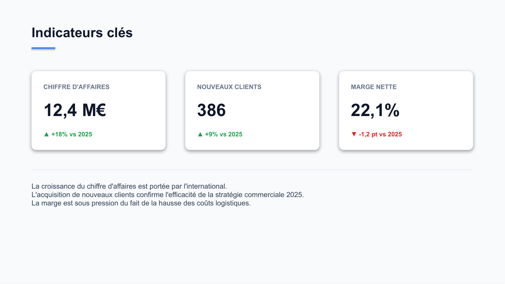
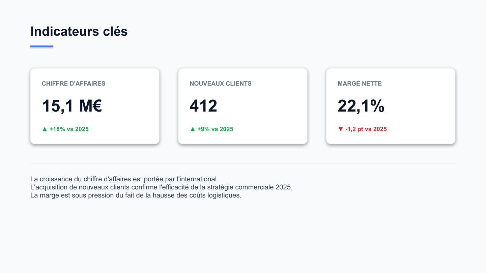

# template-filler

[](LICENSE)
[](https://www.python.org/)

A [Claude Code](https://claude.com/claude-code) skill that fills an
**existing**, already-branded PowerPoint (`.pptx`) or Word (`.docx`) file
with new content — swap a client name, figures, or dates everywhere they
appear, while preserving 100% of the original styling, layout and masters.

|                                     |                                     |
|-------------------------------------|-------------------------------------|
|  |  |

Both slides above are the *same original .pptx*, before and after running
this skill's fill pipeline — every card, color, shadow and layout is
untouched; only the three figures changed.

## Why this one

Its sibling skills ([pptx-builder-skill](https://github.com/Julien339/pptx-builder-skill),
[docx-builder-skill](https://github.com/Julien339/docx-builder-skill),
[pdf-builder-skill](https://github.com/Julien339/pdf-builder-skill)) all
solve "build a **new** document from an HTML design." This one solves a
different, very common problem: you already have a branded template — last
year's report, a client deck template — and you need to reuse it for a new
client or a new period, without redesigning anything and without breaking
its formatting.

- **Zero template prep.** No `{{placeholder}}` tokens to insert first — an
  agent reads the template's actual current content (via python-pptx/
  python-docx, not a text search) and decides what maps to what.
- **Writes are addressed by ID, never by global search-and-replace.** A
  value like "12" can be a real figure in one place and something
  unrelated (a page number, an unrelated count) elsewhere — every write
  targets one specific, previously-identified run, so the wrong occurrence
  never gets touched by accident.
- **Formatting is never touched.** A write sets the *existing* run's text
  in place; python-pptx/python-docx don't rebuild the run, so its font,
  color, bold/italic and every other property survive untouched.
- **A parity check answers "did this silently break something else?"**
  `verify_parity.py` re-reads both the original and the output and asserts
  every untouched run is still byte-identical — the automated version of
  the before/after backup copies people otherwise keep by hand.

## How it works

No HTML/Playwright stage — this skill reads and writes the existing file
directly:

1. **Extract.** `scripts/extract_pptx.py`/`extract_docx.py` walk the
   template via the real python-pptx/python-docx object model and emit a
   flat JSON map of every text run's current text, keyed by a stable ID
   (recursing into grouped shapes, table cells — merge-aware — and each
   section's header/footer).
2. **Decide.** An agent reads the content map and writes `changes.json`:
   a list of `{"id": ..., "new_text": ...}`. A human reviews an old→new
   diff before anything is written.
3. **Apply.** `scripts/apply_pptx.py`/`apply_docx.py` open the *original*
   file and set only the named runs' text, in place.
4. **Verify.** `verify_pptx.py`/`verify_docx.py` catch structural/XML
   corruption; `verify_parity.py` confirms nothing outside `changes.json`
   changed; `render_preview.py` renders the touched slides/pages to PNG so
   the result can actually be looked at.

See `SKILL.md` for the full workflow this skill makes an agent follow,
including the ID scheme and the paragraph-level fallback for runs
PowerPoint/Word split further than is meaningful (a routine autocorrect
artifact).

## Requirements

- Python 3.9+
- [LibreOffice](https://www.libreoffice.org/) (`soffice` on `PATH`, or the
  default Windows install path) — used only by `render_preview.py`

```bash
pip install -r requirements.txt
```

## Using it as a Claude Code skill

Drop this folder into a skills directory so Claude Code (or any agent
runtime that supports the same skill format) can discover and use it:

```bash
# project-level (this repo/project only)
cp -r template-filler-skill /path/to/your/project/.claude/skills/template-filler

# or user-level (every project)
cp -r template-filler-skill ~/.claude/skills/template-filler
```

Then ask the agent to reuse a template (e.g. "fill in this deck with the
new client's info" alongside the file). It will extract the current
content, propose changes, show you a diff, and only write the new file once
you approve.

## Using it as an MCP server

The skill is also available as a standalone **MCP (Model Context Protocol)
server** that works with any MCP-compatible client (Claude Desktop, VS Code
Copilot, Cline, etc.) — no shell script execution needed.

### Installation

```bash
pip install -e /path/to/template-filler-skill
```

### Configuration

Add to your MCP client's configuration file:

```json
{
  "mcpServers": {
    "template-filler": {
      "command": "template-filler-mcp",
      "args": []
    }
  }
}
```

Or run the server directly:

```bash
python -m template_filler_mcp.server
```

### Available MCP Tools

The MCP server exposes 8 tools matching the 4-stage pipeline:

| Tool | Description |
|------|-------------|
| `extract_pptx` / `extract_docx` | Extract all text runs as structured JSON |
| `apply_pptx` / `apply_docx` | Write changes to specific runs, preserving formatting |
| `verify_pptx` / `verify_docx` | Check structural/XML integrity |
| `verify_parity_tool` | Verify output matches original except requested changes |
| `render_preview` | Render slides/pages to PNG (requires LibreOffice) |

### Standalone CLI

A command-line interface is also included:

```bash
template-filler extract pptx template.pptx
template-filler apply pptx template.pptx --changes changes.json output.pptx
template-filler verify pptx output.pptx
template-filler parity original.pptx output.pptx --changes changes.json
template-filler render output.pptx preview/ --pages 1,3,5
```

See `SKILL.md` for the complete MCP workflow documentation.

## Using the scripts directly

The pipeline is plain Python and works outside of any agent, too:

```bash
python scripts/extract_pptx.py template.pptx work/content_map.json
# ... write work/changes.json by hand ...
python scripts/apply_pptx.py template.pptx work/changes.json output.pptx
python scripts/verify_pptx.py output.pptx
python scripts/verify_parity.py template.pptx output.pptx work/changes.json
python scripts/render_preview.py output.pptx work/preview
```

Swap `_pptx` for `_docx` for Word files.

## Known limits

- No image/logo swapping — needs relationship-level (blip) XML surgery not
  implemented in this version.
- Only per-slide (pptx) / per-document-body+headers+footers (docx) content
  is addressable — text inherited from a slide master/layout, or from
  non-default (first-page/even-page) headers/footers, is out of scope.
- Field-coded runs (dates, page numbers, TOC entries built from Word/
  PowerPoint auto-fields) are read-only — writing to one looks successful
  but the app regenerates it on next open.
- docx table cells assume simple paragraph/run content — a table nested
  inside another table's cell isn't addressed.
- Autofit isn't reflowed — if new text is much longer than the original in
  a pptx shrink-to-fit text box, the box may look visually off even though
  the write itself is correct. Always check the rendered preview.

## License

MIT — see [LICENSE](LICENSE).
